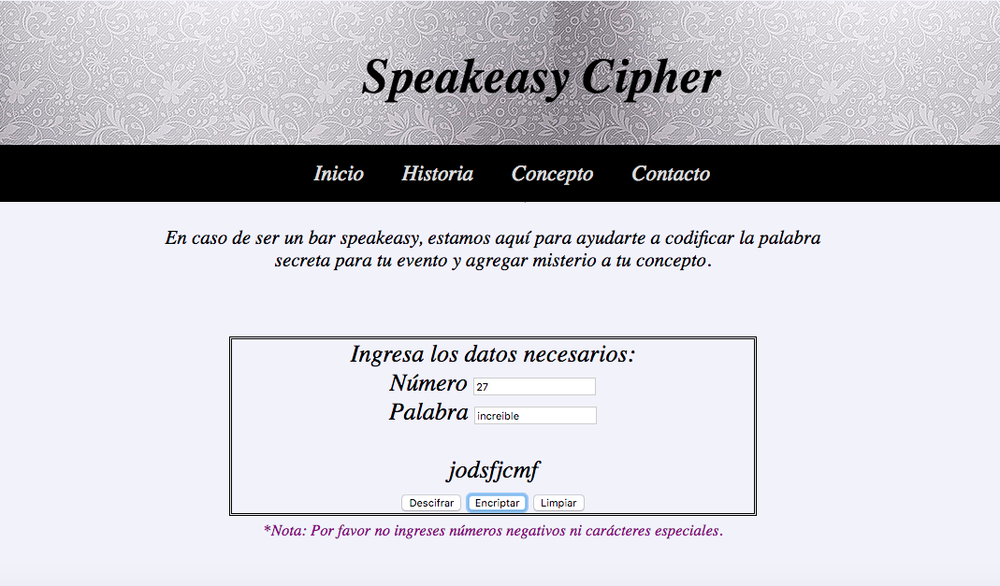
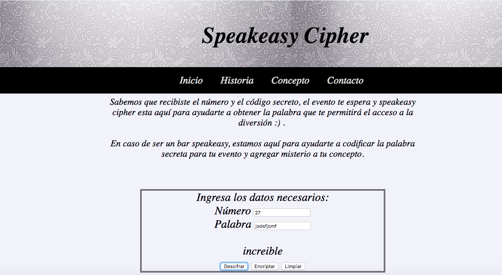
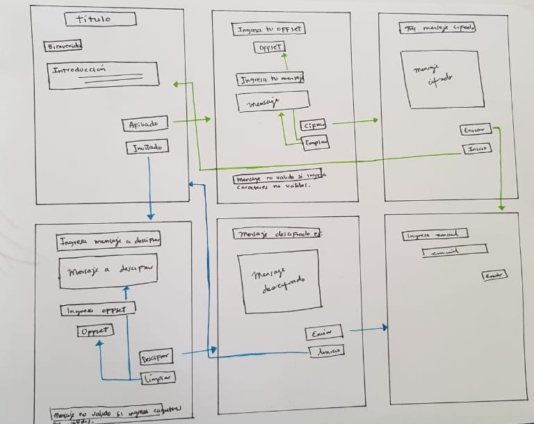
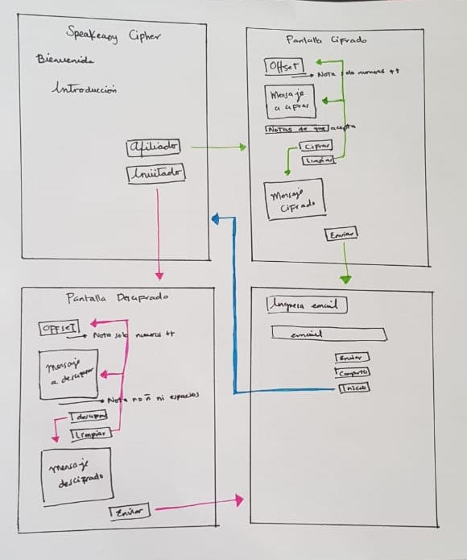
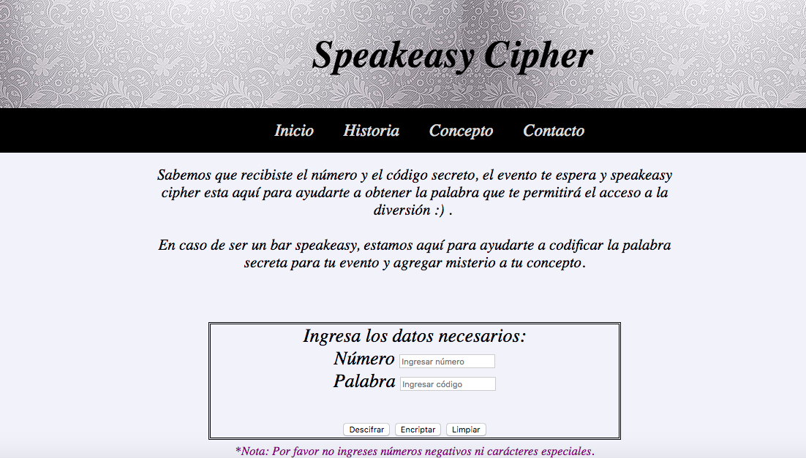
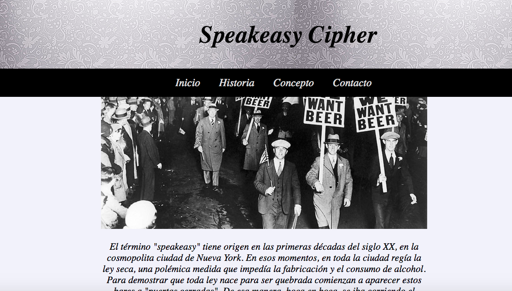
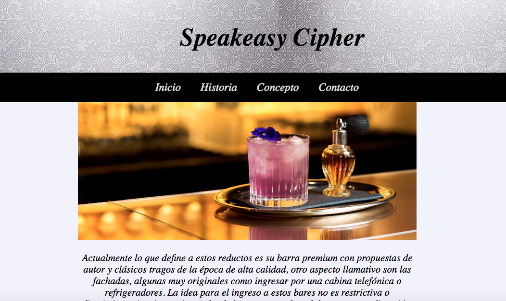
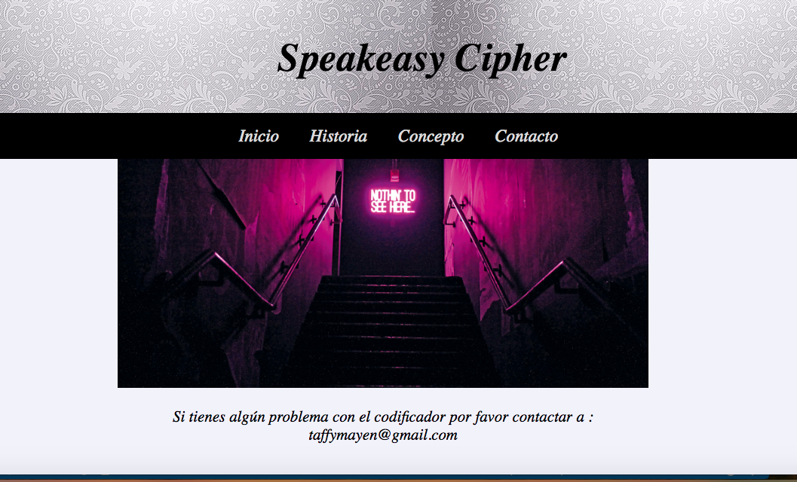

## Introducción

Se dice que toda ley nace para romperse y la ley seca no fue la excepción. Esta polémica ley que empezó a regir en las primeras décadas del siglo XX, prohibía la fabricación y el consumo de alcohol en la cosmopolita ciudad de New York. Lo que dio surgimiento a una serie de bares clandestinos, llamados “speakeasy” o “bares a puertas cerradas”. Estos bares formaban una verdadera comunidad secreta. Para mantener el misterio, se utilizaban contraseñas o invitaciones que solo podían distribuir los clientes.

Generalmente estos bares, se escondían o se camuflaban bajo la fachada de otro negocio para funcionar lejos de los ojos de las autoridades. Pero al estar prohibida también la fabricación de alcohol, los bartenders tenían que ingeniárselas para preparar los mejores tragos intentando disimular el sabor de las pocas bebidas destiladas que se conseguían, que eran de baja calidad. Fue en esta época cuando nacieron los grandes cócteles, de los cuales muchos siguen vivos.

100 años después resurge la magia de la clandestinidad, Actualmente se pueden encontrar versiones modernas de estos bares en cualquier ciudad importante en el mundo, manteniendo el secreto pero complementándolo con una excelente barra de tragos de autor de la más alta calidad.

## Speakeasy Cipher

Speakeasy Cipher nace como complemento a este concepto de clandestinidad agregandole aún más misterio, ya que ahora la palabra secreta para el ingreso estará codificada y los invitados deberán descifrarla para poder ingresar. Lo anterior puede sonar tedioso y complicado, ya que nadie contaría con el tiempo para codificar y descodificar la palabra y probablemente ningún invitado se presentaria al evento.
Es por esto que Speakeasy Cipher hace lo "complicado" por ti, te permite encriptar y descifrar la palabra del ingreso, asi los usuarios de estos bares pueden disfrutar del "juego" de misterio sin dedicar más tiempo que lo necesario.

A continuación se detallan las instrucciones de uso para cada una de las partes.

#### Administrador de un bar
Si eres el administrador de uno de estos bares te permitira codificar "la palabra secreta" para tu evento.

**Instrucciones**

-Ingresa cualquier número positivo de tu preferencia.

-Ingresa la palabra secreta.

-Presiona el boton "Encriptar".

-Voilà! Te proporcionara el código que deberas distribuir a tus invitados. No olvides proporcionarles también el número que elegiste para que puedan descifrar la palabra :) .

#### Invitado al evento
Si eres un invitado a algún evento en un bar speakeasy y recibiste el número y código secreto, te permitirá descifrar la palabra que te permitirá el ingreso.

-Ingresa el número secreto que te proporcionaron.

-Ingresa los caracteres que te proporcionaron.

-Presiona el boton "Descifrar".

-Voilà! la palabra secreta te será revelada :) .

## Diseño

#### Primer sketch

La versión inicial la conformaban 6 pantallas:

**1. Página de bienvenida:**  contiene una introduccion del concepto, asi como dos botones dependiendo del tipo de usuario que ingresa.

**2. Cifrado:** Muestra los input para ingresar los datos necesarios para realizar el cifrado, contiene botón de limpiar (limpia la información de los input) y botón de cifrado que te lleva a la siguiente página.

**3. Mensaje Cifrado:** Aquí se muestra el mensaje cifrado, tiene un botón de enviar y uno de inicio (que regresa a la página de bienvenida).

**4. Descifrado:** Muestra los input para ingresar los datos necesarios para realizar el descifrado, contiene botón de limpiar (limpia la información de los input) y botón de descifrar que te lleva a la siguiente página.

**5. Mensaje Descifrado:** Aquí se muestra el mensaje descifrado, tiene un botón de enviar y uno de inicio (que regresa a la página de bienvenida).

**6. Envio:** Pantalla donde te pide tu email y contiene botón para enviar.

De acuerdo al feedback recibido, el formato contenia muchas mas pantallas de lo necesarias, y lo hacia ver repetitivo y poco eficiente.

#### Segundo sketch

Conformada por 4 pantallas

**1. Página de bienvenida:**  no tuvo modificaciones.

**2. Cifrado:** conservo los input para ingresar los datos necesarios para realizar el cifrado, el botón de cifrado ya realiza en esta  pantalla el mismo y  también contiene el botón de enviar y limpiar.

**3. Descifrado:** conservo los input para ingresar los datos necesarios para realizar el descifrado, el botón de descifrado ya realiza en esta  pantalla el mismo y  también contiene el botón de enviar y limpiar.

**6. Envio:** Pantalla donde te pide tu email y contiene botón para enviar.

Después de realizar esta versión, aún era repetitiva las pantallas que contenian el cifrado y descifrado, ya que la estructura de estas pantallas era exactamente igual y solo cambiaba un botón.Debido a esto se decidio añadir en una misma pantalla los dos botones que permiten realizar la doble funcionalidad, así pudimos obtener un formato mas conciso y estructurado de una manera más eficiente.

#### Diseño Final
Al aplicar las mejoras anterioes , la pantalla de inicio que contenia los botones de Afiliado e Invitado se convirtieron en obsoletos, por lo que se modifico, y solo se conservo la introducción a la página.

Si bien, el nuevo formato parecía eficiente y bien estructurado, también daba la sensación de que faltaba algo de información por lo que la distribución se modifico de la siguiente manera:

**- Inicio:**

Contiene una introducción para los usuarios que ya conocen el concepto speakeasy y para los bares, aquí esta el cifrado y descifrado, asi como la funcionabilidad para limpiar los input.

**- Historia:**

Esta sección es para satisfacer la curiosidad o falta de conocimiento de  nuevos y viejos usuarios, se creo con la intención de generar mas "engagement" con el usuario, que sepan que este concepto tiene una historia interesante y poco a poco se va transformando pero con la misma base.

**- Concepto:**

Comparte con el nuevo usuario, el concepto actual de estos bares, para que entienda el juego de misterio.

**- Contacto:**

Sección para reportar fallas del cifrado.

## Planeación

[Tablero Trello](https://trello.com/invite/b/ZiVBWJ8J/28630b054f2efacdc8bc957bf614d51b/cipher)

## Deploy

[Speakeasy Cipher](https://taphiem.github.io/SCL008-Cipher/src/index.html)

## Test Usabilidad

[Videos](https://useloom.com/share/folder/b04d19473d1b4869bf0b5f1f4e7f4581)